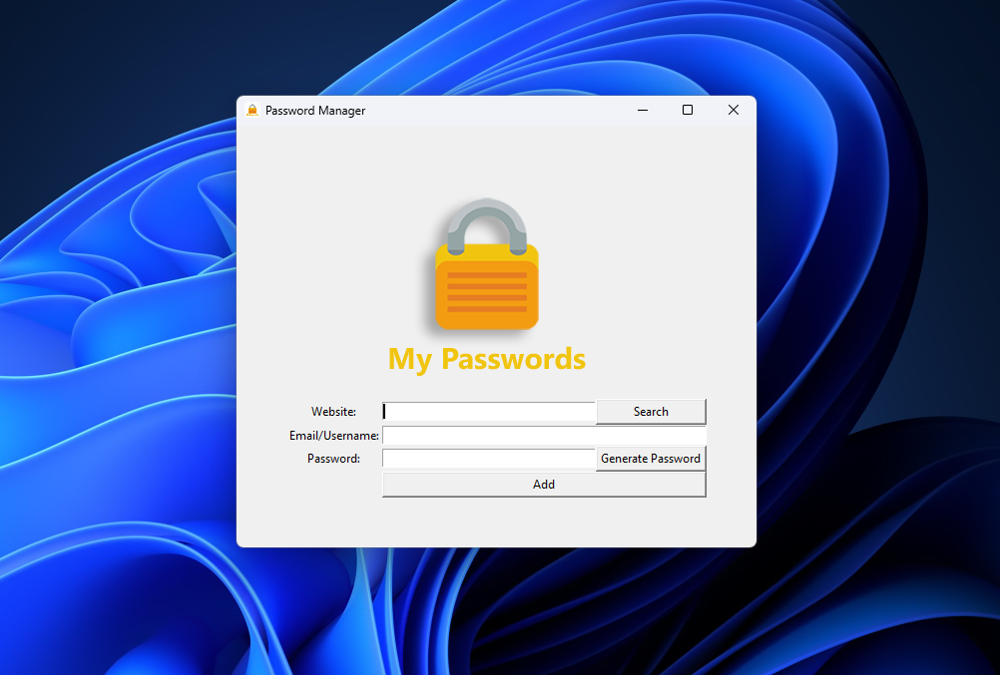

# Password Manager

  

## Overview

The Password Manager is a user-friendly Windows application built 
using Python and the TKinter GUI library. It allows users to store and manage 
their passwords, providing a convenient and safe solution for 
password management without any signups or prerequisites.

## Features

- Securely store and retrieve passwords for various accounts.
- Generate strong and random passwords for new accounts.
- Easy-to-use interface for seamless password management.

## Requirements

- Windows OS

## Installation

1. Go to the Releases section of this repository.
2. Download the latest release (`password_manager_v0.1.0.zip`).
3. Extract the downloaded ZIP file to a location that you know is secure.
4. Double-click on `password_manager_v0.1.0.exe` to start playing the game.

## Usage

1. Launch the application by running `password_manager.py`.
2. Create a master password to access the password database.
3. Add new accounts with unique usernames and passwords.
4. Retrieve passwords when needed with a quick search feature.

## Screenshots

## Security

- Note that, this application as of this version, does not support
encrypted password. It only serves as a interactive
notebook that remembers your passwords (The passwords are saved as plain text).
- It is crucial to save the application folder in a safe local storage, as it is not recoverable if forgotten.

[//]: # ()
[//]: # (## Configuration)

[//]: # ()
[//]: # (You can customize the following parameters in `main.py`:)

[//]: # ()
[//]: # (- `DATABASE_FILE`: Path to the password database file.)

[//]: # (- `ENCRYPTION_KEY`: Secret key used for encryption &#40;keep this secure&#41;.)

## Contributing

If you'd like to contribute, please fork the repository and create a pull request. Please make sure to update tests as appropriate.

## Support

If you encounter any issues or have suggestions, please [open an issue](https://github.com/openapi4/password-manager/issues).

## Roadmap

- [ ] Add Dark mode.
- [ ] Hashing the passwords locally for better security.
- [ ] Upgrade to database file.

## Authors

- [openapi4](https://github.com/openapi4)
